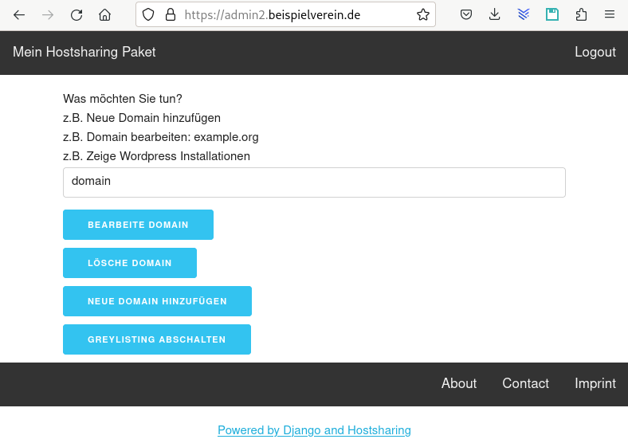
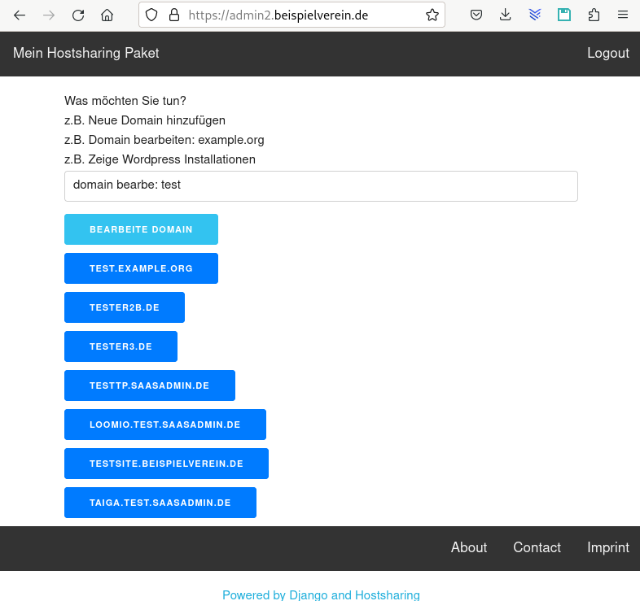
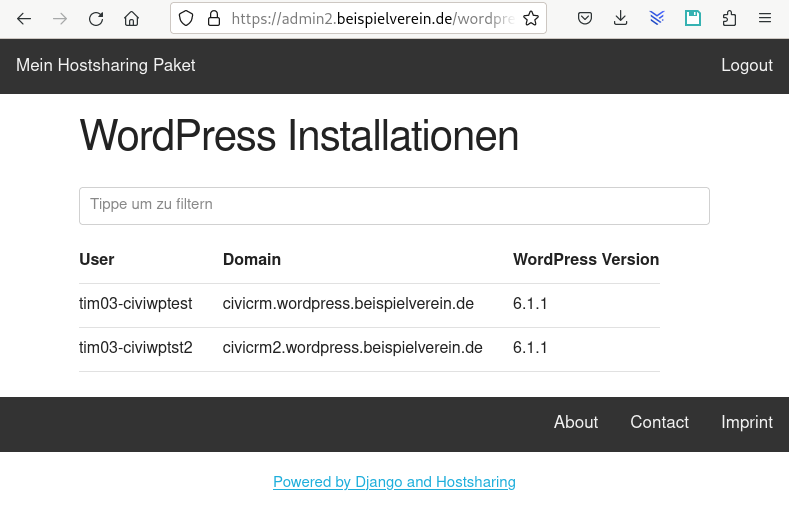

# Dokumentation

Das ist momentan ein Experiment.

Wie können wir es im Moment einfacher für die Mitglieder von Hostsharing machen, Benutzer einzurichten, E-Mail Postfächer zu verwalten, Anwendungen zu installieren und zu pflegen.

Diese Screenshots sollen zeigen, was momentan schon umgesetzt ist:

# Installation

    git clone https://github.com/tpokorra/hsgui
    cd hsgui
    export PIPENV_VENV_IN_PROJECT=1
    export ADMINDOMAIN=admin.meinedomain.de
    make init
    make create_superuser
    make restart
    make collectstatic
    make hsadmin_properties

# Benutzung

Melde dich mit dem Benutzer `xyz00` an, in dem diese Anwendung installiert ist.

# Neue Apps hinzufügen

    cd hsgui
    pipenv shell
    mkdir apps/myapp
    python manage.py startapp myapp apps/myapp

Danach: 

* apps/myapp/apps.py bearbeiten: name = 'apps.myapp'
* App in hsgui/settings.py einfügen
* URLs in hsgui/urls.py ergänzen
